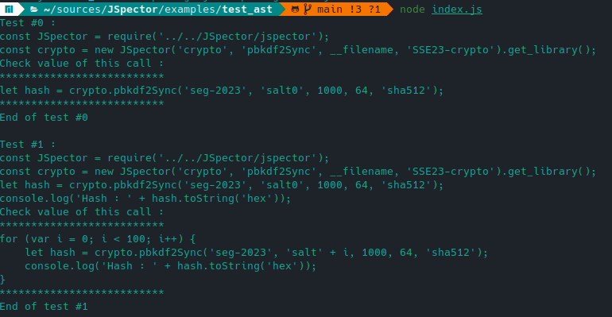

# JStorian - Get an AST for each function call

    

## Quickstart

Import the library

`import {getAllCalls, deepCopy} from '../JStorian/jstorian.mjs';`

    

## License

All rights reserved.

Image is under public domain and created by *BartM* from [creazilla.com](https://creazilla.com) :

- [Archeologist penguin](https://creazilla.com/fr/nodes/12487-archeologist-penguin-clipart)
