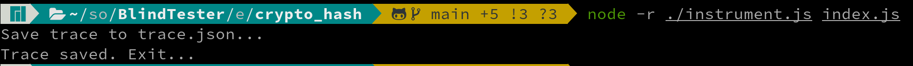
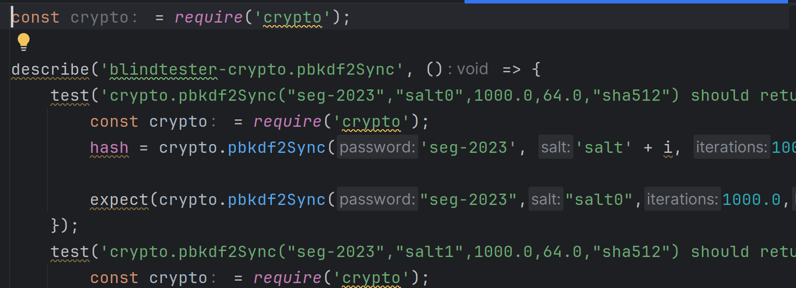
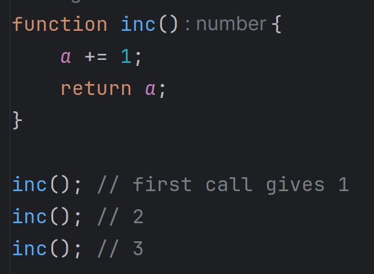

# BlindTester

<p align="center">
    
</p>

Project for the Software Engineering Seminar 2023 at University of Bern for the BeNeFri Joint Master of Computer Science.

The goal of this project is to generate unit tests for a specific function from traces files that contains information about runtime execution of a program.

Actually, this project contains a small Javascript library to get runtime execution trace from nodejs runtime execution and a java program that will generate Jest unit tests for javascript programs.

Each function call will be considered as a black box. The trace contains all inputs and output for a specific function. BlindTester will generate a test for each distinct call.

## 1. Overview

To be able to  capture NodeJS runtime execution, we developed a small tool that need to be injected in your main JS file running in NodeJS.

After execution of your program, JSpector will output a trace.json file in the same directory of your project. 

From this JSON file, we will be able to generate unit tests with our Java application Blindtesters.

- Steps 1 : Inject the library [JSpector](JSpector/) in your NodeJS project to capture the execution call of a specific function

- Steps 2 : Run your NodeJS application normally and let JSpector listen all function calls and generate a JSON file containing a trace and an ASTs for each call.

- Steps 3 : Use Blindtester to work on the generated JSON file to generate some unit tests based on the runtime execution or generate a report based on the trace.

- Steps 4 : Manually run the newly created tests to verify that they pass and use this methodology to make regression tests and verify that the application and the functions tested still work with upgrades.

## 2. Installation

### 2.1 External dependencies

- Install last version of [NodeJS](https://nodejs.org/)

- Install [Open JDK 22](https://jdk.java.net/22/) or newer

- Install last version of [Maven](https://maven.apache.org/)

- Ensure `distutils` is installed if you are running python 3.12 or newer on your system
  - With pip
    - ```$ sh pip install setuptools ```
  - With pip3
    - ```$ pip3 install setuptools```
  - With brew on Mac OSX
    - ```$ brew install python-setuptools```

#### 2.1.1 Data science dependencies

For now, our java application call a python script to make usage opf library to compute kmeans clusters.

This means a minimal setup must be done for Blindtester to be able to execute our python script.

We may implement later a better way to do KMeans using another library like Apache Spark.

##### 2.1.1.1 K-means specific configuration

Blindtester is actually using a python script to compute kmeans clusters. 

``` sh
$ cd kmeans
$ python3 -m venv venv
$ source venv/bin/activate
$ pip install -r requirements.txt
```

### 2.2 Compile the test generator BlindTester

Go to the project's directory and : 

``` sh
$ mvn clean compile assembly:single
```

## Generate an execution trace for a project

Please use [JSpector](JSpector) to generate a trace.json file in your project to be used to generate tests.

## Generate a report and tests from an execution trace file

### 1. Report generation (Optional)

Use the following command to generate a report based on the trace file :

``` sh
java -jar path_to_jar/blindtester.jar analyse [TRACE_PATH]
```

This will generate a PDF report on the analysis that may help you to decide which set of tests to generate.

### 2. Unit tests generation

USe the following command to generate unit tests based on the trace file :

``` sh
$ java -jar testbuilder.jar generate [GENERATOR] [TEST_TYPE] [TRACE_PATH]
```

Where
- `GENERATOR` is the name of the generator:
    - `jest` : [Jest](https://jestjs.io/) is Test framework for JavaScript and TypeScript
- `TEST_TYPE` one option among the following:
    - `all`     : Generate a test for all calls in the trace
    - `distinct`: Generate tests only for distinct calls
    - `minimal` : Generate tests only for the minimal set of calls
    - `kmeans`  : Generate only one test for detected cluster via K-means method

*At this time, only a generator for Jest is implemented in BlindTester*

## Generate a report and tests from an an execution trace file

#### Execute tests with Jest

Go to your project directory and :

``` sh
# If jest is not installed please install it
$ npm install jest

# run tests in the current directory
$ ./node_modules/jest/bin/jest.js
```

## Examples

All examples are available in the [examples directory](examples)

For all tests below we assume that you are in the root directory of the BlindTester project.

### Crypto - Generate tests for all runtime execution calls

#### 1. Generate a trace

```shell
cd examples/crypto_hash
npm install
node -r ./instrument.js index.js
cd ../../ #return to root directory
```

<p align="center">
    
</p>

#### 2. Create tests from the trace

Function to test : `pbkdf2Sync` function from Crypto module of NodeJS

```shell
java -jar target/blindtester-1.0-SNAPSHOT-jar-with-dependencies.jar generate jest all examples/crypto_hash/trace.json
```

<p align="center">
    
</p>

#### 3. Execute the tests

```shell
cd examples/crypto_hash
./node_modules/jest/bin/jest.js
```

### Fourier - Generate a report

Function to test : `fromGain` from decibels library used by `fourier-transform` library.

#### 1. Generate a trace

```shell
cd examples/fourier_analysis
npm install
node -r ./instrument.js index.js  
cd ../../ #return to root directory
```

#### 2. Generate the report (Optional)

```shell
java -jar target/blindtester-1.0-SNAPSHOT-jar-with-dependencies.jar generate analyse examples/crypto_hash/trace.json
```

You will find the generated report in the project directory.

### Handle side effects by keeping all detected calls

The goal is to check that function with side effects are handled correctly.

<p align="center">
    
</p>

#### 1. Generate a trace

```shell
cd examples/side_effect
npm install
node -r ./instrument.js index.js  
cd ../../ #return to root directory
```

#### 2. Create tests from the trace

```shell
java -jar target/blindtester-1.0-SNAPSHOT-jar-with-dependencies.jar generate jest minimal examples/side_effect/trace.json
```

#### 3. Execute the tests

```shell
cd examples/side_effect
./node_modules/jest/bin/jest.js
```

### MathJS - Detect implementation changes for a function over time

Function to test : `mod` from mathjs library.

#### 1. Generate a trace

```shell
cd examples/diff_mathjs
npm install
node -r ./instrument.js index.js  
cd ../../ #return to root directory
```

#### 2. Create tests from the trace

```shell
java -jar target/blindtester-1.0-SNAPSHOT-jar-with-dependencies.jar generate jest all examples/diff_mathjs/trace.json
```

#### 3. Execute the tests

```shell
cd examples/diff_mathjs
./node_modules/jest/bin/jest.js
```

Confirm that they all pass.

#### 4. Change mathjs version in package.json

Edit `examples/diff_mathjs/package.json` to change version from 11.8.0 to 12.4.1.

#### 5. Install new dependencies

```shell
npm install
```

#### 6. Execute the tests again with the new version

```shell
./node_modules/jest/bin/jest.js
```

You can now see that the tests are failing due to an implementation change in the function.

## License

All rights reserved.

Image is under CCA 4.0 and created by *JoyPixels* from [creazilla.com](https://creazilla.com) :

- [Glasses](https://creazilla.com/nodes/46374-sunglasses-emoji-clipart)
