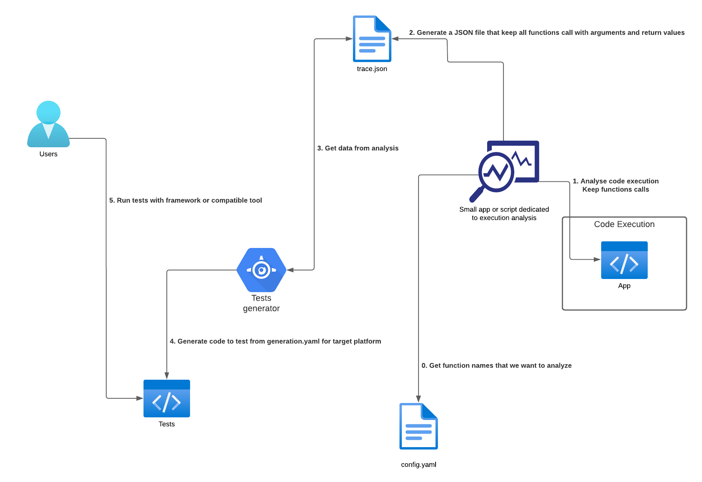

# SSE23-Project - Software Engineering Seminar - 2023

## Automatic tests generation from execution

## NodeJS Execution Analyzer

[Analyzer](node_execution_analyzer/)

## Tests generator

[Generator](tests_generator/)

## Proof of concept

[PoC Runtime Analysis](some_proofs_of_concepts/poc_runtime/)

[PoC Wrapper](some_proofs_of_concepts/poc_wrapper/)
