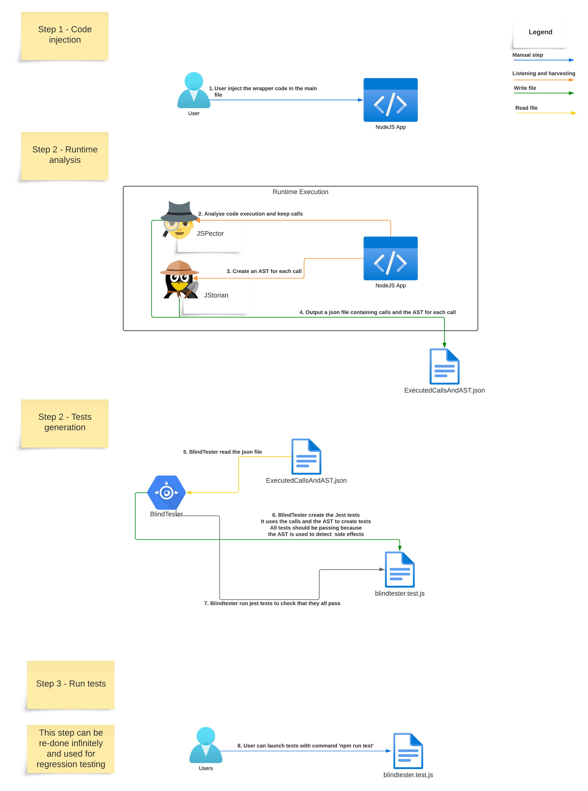

# BlindTester

<p align="center">
    
</p>

Project for the Software Engineering Seminar 2023 at University of Bern for the BeNeFri Joint Master of Computer Science.

The goal of this project is to generate automatically tests for a specific function from runtime execution.

## Dependencies

- Install [NodeJS](https://nodejs.org/)

- Install [Open JDK 21](https://jdk.java.net/21/)

- Install [Maven](https://maven.apache.org/)

## How it works ?

<p align="center">
    
</p>

- Steps 1 : Inject [JSpector](https://maven.apache.org/) which contains [JStorian](https://maven.apache.org/) to capture the execution call of a function

- Steps 2 : Run the application you want to test and let JSpector and JStorian listen all function calls and generate a JSON file containing a trace and ASTs for each call.

- Steps 3 : Use Blindtester to work on the generated JSON file to generate some unit tests based on the runtime execution

- Steps 4 : Run the tests by hand to verify that they pass and use this methodology to make regression tests and verify that the application and the functions tested still work with upgrades

## Installation

Each function call is considered as a black box. The trace contains all inputs and output for a specific function. BlindTester will generate a test for each distinct call.

### Compile BlindTester

Go to the project's directory and : 

``` sh
$ mvn clean compile assembly:single
```

### K-means specific configuration
We currently need a python installation to compute the K-means cluster. If you want to use this feature, please make sure that you have a valid python installation on your computer. Then, create a python virtual environment in the K-means folder and install all the dependencies in the virtual environment.

``` sh
$ cd kmeans
$ python3 -m venv venv
$ source venv/bin/activate
$ pip install -r requirements.txt
```

You can now use the K-means option.

NOTE: This is a quick solution to be able to provide some clustering. We might work on a Java implementation with Spark someday.

## Usage 

### Report generation

``` sh
java -jar path_to_jar/blindtester.jar analyse [TRACE_PATH]
```

### Generate a trace

Please use [JSpector](JSpector) to generate a trace.json file in your project to be used to generate tests.

### Unit tests generation

``` sh
$ java -jar testbuilder.jar generate [GENERATOR] [TEST_TYPE] [TRACE_PATH]
```

Where `GENERATOR` is the name of the generator that target a test system and `TEST_TYPE` one option among the following:

- `all` : Generate a test for all calls in the trace
- `distinct`: Generate tests only for distinct calls
- `minimal`: Generate tests only for the minimal set of calls
- `kmeans`: Generate only one test for detected cluster via K-means method

*At this time, only a generator for Jest is implemented in BlindTester*

#### Generate all tests from a trace for Jest

``` sh
$ java -jar path_to_jar/blindtester.jar jest all path_to_trace/trace.json
```

#### Execute tests with Jest

Go to your project directory and : 

``` sh
# If jest is not installed please install it
$ npm install jest

# run tests in the current directory
$ ./node_modules/jest/bin/jest.js
```

## Examples

All examples are available in the [examples directory](examples)

For all tests below we assume that you are in the root directory of the BlindTester project.

### Crypto - Generate tests for all runtime execution calls

#### 1. Generate a trace

```shell
cd examples/crypto_hash
node -r ./instrument.js index.js  
cd ../../ #return to root directory
```

<p align="center">
    
</p>

#### 2. Create tests from the trace

Function to test : `pbkdf2Sync` function from Crypto module of NodeJS

```shell
java -jar target/blindtester-1.0-SNAPSHOT-jar-with-dependencies.jar generate jest all examples/crypto_hash/trace.json
```

<p align="center">
    
</p>

#### 3. Execute the tests

```shell
cd examples/crypto_hash
./node_modules/jest/bin/jest.js
```

<p align="center">
    
</p>

### Fourier - Generate a report

Function to test : `fromGain` from decibels library used by `fourier-transform` library.

#### 1. Generate a trace

```shell
cd examples/fourier_analysis
node -r ./instrument.js index.js  
cd ../../ #return to root directory
```

#### 2. Generate the report

```shell
java -jar target/blindtester-1.0-SNAPSHOT-jar-with-dependencies.jar generate analyse examples/crypto_hash/trace.json
```

#### 2. Open the PDF file generated

TODO

### Handle side effects by keeping all detected calls

The goal is to check that function with side effects are handled correctly.

<p align="center">
    
</p>

#### 1. Generate a trace

```shell
cd examples/side_effect
node -r ./instrument.js index.js  
cd ../../ #return to root directory
```

#### 2. Create tests from the trace

```shell
java -jar target/blindtester-1.0-SNAPSHOT-jar-with-dependencies.jar generate jest minimal examples/side_effect/trace.json
```

#### 3. Execute the tests

```shell
cd examples/side_effect
./node_modules/jest/bin/jest.js
```

### MathJS - Detect implementation changes for function div

TODO

## License

All rights reserved.

Image is under CCA 4.0 and created by *JoyPixels* from [creazilla.com](https://creazilla.com) :

- [Glasses](https://creazilla.com/nodes/46374-sunglasses-emoji-clipart)
