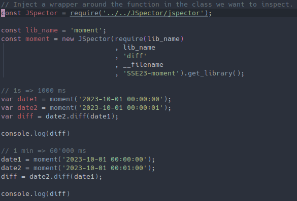
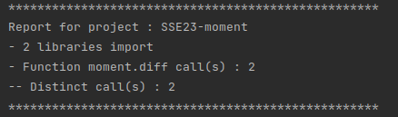
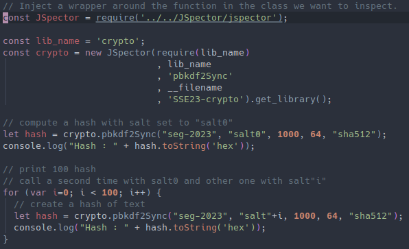
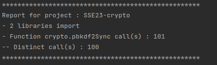

# BlindTester

<p align="center">
    
</p>

Project for the Software Engineering Seminar 2023 at University of Bern for the BeNeFri Joint Master of Computer Science.

The goal of this project is to generate automatically tests for a specific function from runtime execution.

## Dependencies

- Install [NodeJS](https://nodejs.org/)

- Install [Open JDK 19](https://jdk.java.net/19/)

- Install [Maven](https://maven.apache.org/)

## Get trace from execution with Inspectors

<p align="center">
    
</p>

### JSpector - Get trace from a NodeJS app execution

Inject the following snippet in your application to get a trace of the desired function to analyze :

``` javascript
const JSpector = require('path_to/JSpector/jspector');

// replace LIB_NAME with the name of your library that contains the function to test
const lib_name = 'LIB_NAME';

// replace FUNCTION_NAME with the name of your function to test
const crypto = new JSpector(require(lib_name), lib_name, 'FUNCTION_NAME', __filename, 'SSE23-crypto').get_library();
```

*Please note that the trace contains the path of the project. Please restart JSpector or edit the trace.json file if your project changed path*

## BlindTester

<p align="center">
    
</p>

Each function call is considered as a black box. The trace contains all inputs and output for a specific function. BlindTester will generate a test for each distinct call.

### Compile BlindTester

Go to the project's directory and : 

``` sh
$ mvn clean compile assembly:single
```

### Usage 

``` sh
$ java -jar path_to_jar/blindtester.jar GENERATOR path_to_trace/trace.json
```

Where `GENERATOR` is the name of the generator that target a test system.

*At this time, only a generator for Jest is implemented in BlindTester*

#### Generate some tests for Jest

``` sh
$ java -jar path_to_jar/blindtester.jar jest path_to_trace/trace.json
```

#### Execute tests with Jest

Go to your project directory and : 

``` sh
# If jest is not installed please install it
$ npm install jest

# run tests in the current directory
$ ./node_modules/jest/bin/jest.js
```

## Example

All examples are available in the [examples directory](examples/)

### Moment - Simple example

Compute the difference of two dates for two examples.

1. JSpector injection

<p align="center">
    
</p>

2. Start BlindTester on the trace

<p align="center">
    
</p>

Coming soon...

### Crypto - Advanced example

Generate 101 function calls to hash a word of which two are duplicates.

1. JSpector injection

<p align="center">
    
</p>

2. Start BlindTester on the trace

<p align="center">
    
</p>

3. Generated tests

<p align="center">
    
</p>

4. Start Jest on automatically generated tests

<p align="center">
    
</p>

### D3 - Advanced example

Create a png file that contains small random rectangle for each pixels.

<p align="center">
    
</p>

Coming soon...

## License

All rights reserved.

Images are both under CCA 4.0 and created by *JoyPixels* from [creazilla.com](https://creazilla.com) :

- [Glasses](https://creazilla.com/nodes/46374-sunglasses-emoji-clipart)

- [Detective](https://creazilla.com/nodes/48141-detective-emoji-clipart)
