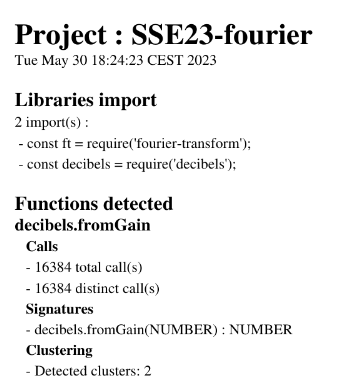
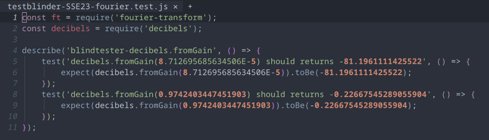
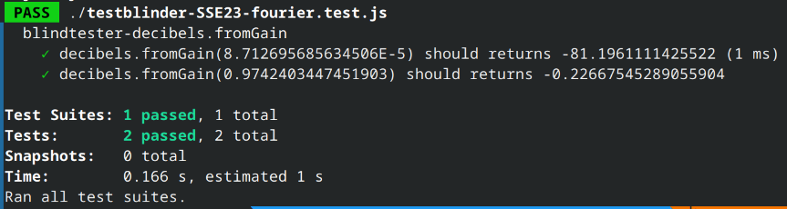
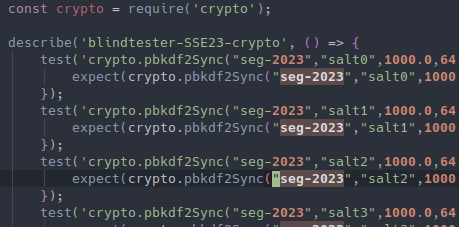
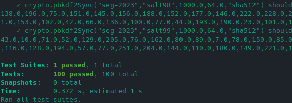

# BlindTester

<p align="center">
    
</p>

Project for the Software Engineering Seminar 2023 at University of Bern for the BeNeFri Joint Master of Computer Science.

The goal of this project is to generate automatically tests for a specific function from runtime execution.

## Dependencies

- Install [NodeJS](https://nodejs.org/)

- Install [Open JDK 19](https://jdk.java.net/19/)

- Install [Maven](https://maven.apache.org/)

## Installation

Each function call is considered as a black box. The trace contains all inputs and output for a specific function. BlindTester will generate a test for each distinct call.

### Compile BlindTester

Go to the project's directory and : 

``` sh
$ mvn clean compile assembly:single
```

### K-means specific configuration
We currently need a python installation to compute the K-means cluster. If you want to use this feature, please make sure that you have a valid python installation on your computer. Then, create a python virtual environment in the K-means folder and install all the dependencies in the virtual environment.

``` sh
$ cd kmeans
$ python3 -m venv venv
$ source venv/bin/activate
$ pip install -r requirements.txt
```

You can now use the K-means option.

NOTE: This is a quick solution to be able to provide some clustering. We might work on a Java implementation if we have enough time by the end of the semester. This was easier for us to do so in a first step for a proof-of-concept.

## Usage 

### Report generation

``` sh
java -jar path_to_jar/blindtester.jar analyse [TRACE_PATH]
```

### Unit tests generation

``` sh
$ java -jar testbuilder.jar generate [GENERATOR] [TEST_TYPE] [TRACE_PATH]
```

Where `GENERATOR` is the name of the generator that target a test system and `TEST_TYPE` one option among the following:

- `all` : Generate a test for all calls in the trace
- `distinct`: Generate tests only for distinct calls
- `minimal`: Generate tests only for the minimal set of calls
- `kmeans`: Generate only one test for detected cluster via K-means method

*At this time, only a generator for Jest is implemented in BlindTester*

#### Generate all tests from a trace for Jest

``` sh
$ java -jar path_to_jar/blindtester.jar jest all path_to_trace/trace.json
```

#### Execute tests with Jest

Go to your project directory and : 

``` sh
# If jest is not installed please install it
$ npm install jest

# run tests in the current directory
$ ./node_modules/jest/bin/jest.js
```

## Examples

All examples are available in the [examples directory](examples/)

### Fourier

`fromGain` function from decibels library used by `fourier-transform` library:

- Add JSpector

<p align="center">
    
</p>

- Generate a report

<p align="center">
    
</p>

- Generated unit tests

<p align="center">
    
</p>

- Test execution with jest

<p align="center">
    
</p>

### Crypto

`pbkdf2Sync` function from Crypto module of NodeJS

101 calls to hash a word of which two are duplicates.

- Generated tests for a distinct set of values

<p align="center">
    
</p>

- Start Jest on automatically generated tests

<p align="center">
    
</p>

## License

All rights reserved.

Images are both under CCA 4.0 and created by *JoyPixels* from [creazilla.com](https://creazilla.com) :

- [Glasses](https://creazilla.com/nodes/46374-sunglasses-emoji-clipart)

- [Detective](https://creazilla.com/nodes/48141-detective-emoji-clipart)
